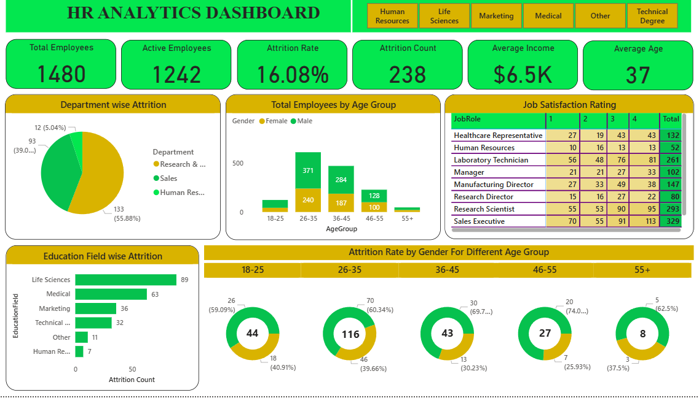

# HR-Analytics-Dashboard-PowerBI
Interactive Power BI dashboard analyzing employee attrition and workforce trends.

## Tools Used
Power BI, DAX, Excel

## Key Metrics
- Total employees: 1,480
- Active employees: 1,242
- Attrition count: 238
- Attrition rate: 16.08%
- Average age: 37

## What I Analyzed
- Attrition by department and education field
- Employee count by age group and gender
- Attrition rate by gender across age groups
- Job satisfaction rating by job role

## Dashboard Preview

## Key Findings

- Attrition is 16.08% (238 of 1,480 employees).
- Research & Development accounts for 55.88% of attrition (133), followed by Sales (93).
- The 26–35 age group has the most leavers (116 of 238).
- Life Sciences (89) and Medical (63) are the education fields with the most attrition.
